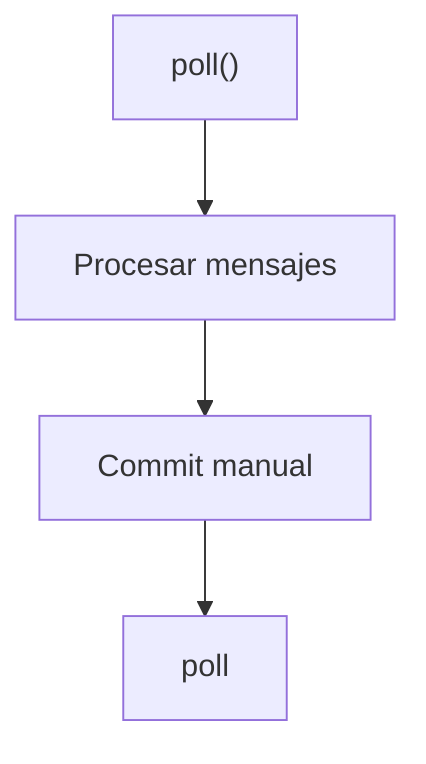

[[KAFKA]]

# <mark style="background:#d4b106">Kafka Subscribers</mark>

Un subscriber es una aplicación que lee los mensajes de uno o mas topicos en kafka
## <mark style="background:#40a9ff">Poll ()</mark>

Como el consumer obtiene los mensajes
- Solicita los mensajes al broker
- Mantiene viva la sesión del consumer
- Permite detectar falllos
- Dispara rebalanceos so algo anda mal

**IMPORTANTE:** Si no llamas a poll() frecuentemente Kafka asume que el consumer murio

---
## <mark style="background:#40a9ff">Commits de offsets :  AUTO vs MANUAL</mark>

Un commit es decirle a kafka
**`Ya procese mensaje hasta este offset`**
Kafka guarda esto en:
`__consumer _ofsets`

### <mark style="background:#d3f8b6">Auto Commit (Commit Automatico)</mark> 

**Configuración en Java:**

```PROPERTIES
enable.auto.commit=true
auto.commit.interval.ms=5000
```

Kafka hace commit cada X milisegundos automaticamente

**Ventajas:**
- Fácil
- Menos Código

**Desventajas (IMPORTANTE)**
- Puede hacer commit **ANTES** de que termine de procesar
- Riesgo de perdida de mensajes

**Caso peligroso**
- 1 poll()
- 2 Kafka hace auto-commit
- 3 App crashea
- 4 Mensajes no se Procesan

### <mark style="background:#d3f8b6">Manual Commit (RECOMENDADO)</mark>

**Configuración en Java:**

```PROPERTIES
enable.auto.commit=false
```

Ahora tu decides cuando hacer commit

**Commit Sync()**
Bloqueante, seguro

```JAVA
consumer.commitSync();
```

- Garantiza el commit
- Mas lento

**Commit Async()**
No bloqueante, más rapido

```JAVA
consumer.commitAsync();
```

- Mas Performance
- No garantiza éxito

**Mejor Practica**
Commit SOLO después de procesar correctamente

---
## <mark style="background:#40a9ff">Rebalanceo</mark>
Un rebalanceo ocurre cuando Kafka redistribuye peticiones

**Ocurre cuando:**
- Un consumer se une al grupo
- Un consumer muere
- Cambia el número de particiones
- poll() tarda demasiado

**¿Que pasa durante el rebalaceo?**
1. Todos los consumers se detienen
2. Kafka reasigna particiones
3. Se reinicia el consumo

**Durante el rebalanceo:**
- No se consumen mensajes
- Si no manejas bien commits -> Duplicados
 
 **Ejemplo de problema común**
 
```
CONSUMER PROCESA LOS MENSAJES
REBALANCE OCURRE ANTES DEL COMMIT
NUEVO CONSUMER VUELVE A PROCESAR ESOS MENSAJES
RESULTADO: DUPLICADO
```

---
## <mark style="background:#40a9ff">Consumer Log (Uno de los KPIS más importantes )</mark>
Es la diferencia entre:
<center>ULTIMO OFFSET PRODUCIDO
Y
ULTIMO OFFSET CONSUMIDO</center>
Ejemplo:
```
ULTIMO MENSAJE EN PARTICIÓN: OFFSET 500
CONSUMER VA EN OFFSET : 450
LAG = 50
```

**¿Que significa Lag Alto?**
- El consumer esta lento
- Hay errores
- Falta escalamiento
- Problemas de Commit

**Lag = back log**

**¿Como reducir el Lag?**
- Aumentar consumers (hasta el # de particiones)
- Optimizar procesamiento
- Procesar el batch
- Evitar commit muy frecuentes
- Usar Async processing (Con cuidado)

---
## <mark style="background:#40a9ff">Flujo Completo:</mark>



---
## <mark style="background:#40a9ff">RESUMEN</mark>
- poll() -> Mantiene vivo al consumer
- Auto Commit -> Facil pero riesgoso
- Manual Commit -> Seguro y recomendado
- Rebalance -> redistribuye las particiones
- Consumer Lag -> Métrica crítica